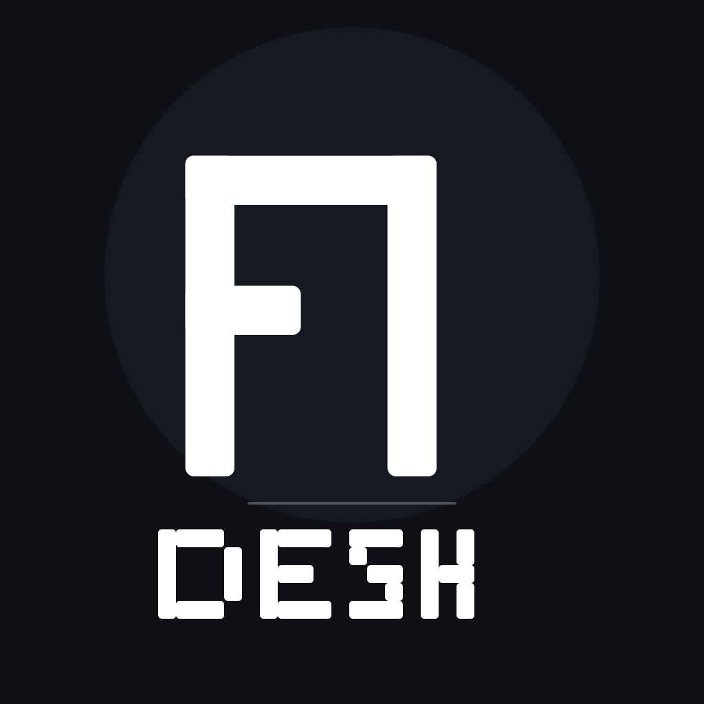

# Pi Desktop

A native-feeling desktop shell for the **Pi Coding Agent**, built with Tauri + Lit.
Forks and extends [`gustavonline/pi-desktop`](https://github.com/gustavonline/pi-desktop)
with a real PTY terminal, auto session naming, and tuned Windows + macOS builds.

<p align="left">
  <a href="https://github.com/LCorleone/pi-desktop/actions/workflows/ci.yml"></a>
  <a href="https://github.com/LCorleone/pi-desktop/releases"></a>
  <a href="./LICENSE"></a>
</p>

<p align="left">
  
</p>

---

## What this fork adds

| Feature | Description |
|---|---|
| **PTY terminal** | Real pseudo-terminal backend (Rust `portable-pty`) instead of xterm.js addons. Interactive programs, proper resize, no chat-timeline leakage. |
| **Auto session naming** | Sessions get LLM-generated titles via `pi --print`. Works with every model in the picker. No config parsing or manual API calls. |
| **Streaming performance** | Text rendering coalesced to one per animation frame (~60fps) — no stutter in long sessions. |
| **Combined CI** | Single `workflow_dispatch` builds both Windows `.exe` and macOS `.dmg` in parallel. |
| **Windows polish** | Native-style window controls on sidebar, JetBrains Mono as default font, custom blue app icon. |
| **Clean docs** | README, CHANGELOG, release notes, and TODO all rewritten for this fork. |

For the full upstream feature set (multi-workspace, streaming chat, slash palette, model picker, themes, packages), see the original project.

---

## Features

- **Multi-workspace** shell with pin/reorder, project-aware sessions
- **Streaming chat** with tools, thinking timeline, and interactive workflows
- **Real PTY docked terminal** — interactive shell inside the chat pane
- **Auto-naming** — sessions title themselves after the first message
- **Composer slash palette** with deterministic built-in + extension commands
- **Model/provider picker** with auth management and diagnostics
- **Right-side file split** with resize and drag/drop
- **Package manager** (`pi install/remove/update/list`) with settings UI
- **Themes & settings** — bundled themes, CLI path override, update checks

Full capability map: [`FEATURE_MAPPING.md`](./FEATURE_MAPPING.md).

---

## Download

Releases at **[github.com/LCorleone/pi-desktop/releases](https://github.com/LCorleone/pi-desktop/releases)**.

A single [`workflow_dispatch`](./.github/workflows/release.yml) builds both platforms:

| Platform | Artifact |
|----------|----------|
| **Windows** | NSIS `.exe` installer |
| **macOS** | Unsigned Intel `.dmg` (x86_64, cross-compiled on Apple Silicon) |

Releases are **drafts** tagged `manual-build-<N>`. Check the full [Releases list](https://github.com/LCorleone/pi-desktop/releases) for the latest.

### Unsigned builds

**Windows:** SmartScreen → **More info** → **Run anyway**.

**macOS:** `xattr -cr "/Applications/Pi Desktop.app"` after mounting.

---

## First run

Install the Pi CLI:

```bash
npm install -g @earendil-works/pi-coding-agent
```

The app shows an onboarding card if `pi` is missing. Requires Node.js ≥ 22.

---

## Build from source

```bash
npm install
npm run tauri dev       # dev
npm run tauri build     # production (artifacts: src-tauri/target/release/bundle/)
```

Prerequisites: Node.js ≥ 22, Rust toolchain, Tauri 2 platform deps.

---

## Architecture

- **Lit + TypeScript** frontend (not React)
- **Tauri 2 / Rust** backend — PTY, RPC process management, filesystem
- **`pi --mode rpc`** — JSON-RPC line protocol over stdin/stdout for AI chat
- **`pi --print`** — one-shot mode for title generation
- **`portable-pty`** — real terminal backend for the docked shell

Deeper: [`docs/ARCHITECTURE.md`](./docs/ARCHITECTURE.md), [`docs/CAPABILITY_MODEL.md`](./docs/CAPABILITY_MODEL.md).

---

## Credit

Fork of [`gustavonline/pi-desktop`](https://github.com/gustavonline/pi-desktop). The desktop shell,
multi-session runtime, and extension model are the original project's work.

## License

MIT — see [`LICENSE`](./LICENSE).
